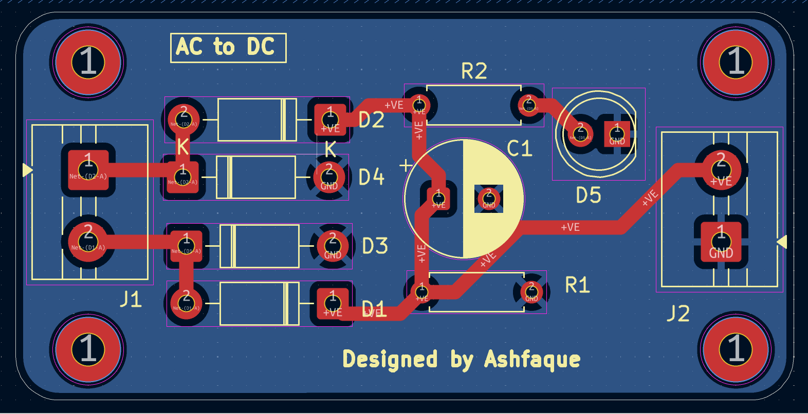

# Amateur AC to DC Bridge Rectifier — PCB Design
 
One of my earliest PCB designs, created independently during the early stages of learning KiCad. Unlike my STM32 projects which followed tutorial series, this board was laid out entirely by hand — component placement, trace routing, and board shaping were all done independently without guided instruction. A foundational project that built my confidence in the full PCB design workflow.
 
---
 
## Preview
 
### Schematic

 
### PCB Layout

 
### 3D View

 
---
 
## Project overview
 
| Property | Details |
|---|---|
| **Circuit type** | Full-wave bridge rectifier with capacitor filter |
| **Input** | AC mains (via transformer secondary) |
| **Output** | ~15.6V DC (unregulated) |
| **Output connector** | 2-pin screw terminal (Molex 282837-2) |
| **Board layers** | 2-layer |
| **EDA Tool** | KiCad |
| **Routing** | Manual — fully hand-routed |
| **Status** | Design complete |
 
---
 
## How it works
 
AC voltage from a transformer secondary enters the board, passes through a **diode bridge** (four diodes in a bridge configuration), and is converted to pulsating DC. A **filter capacitor** smooths the pulsating DC into a steady output voltage. The output is brought out via a 2-pin screw terminal for easy connection.
 
This is one of the most fundamental power electronics circuits and forms the basis for nearly all linear power supply designs.
 
---
 
## Circuit stages
 
| Stage | Component | Function |
|---|---|---|
| AC Input | 2-pin screw terminal | Accepts transformer secondary AC output |
| Rectification | Diode bridge (4 diodes) | Converts AC to pulsating DC |
| Filtering | Electrolytic capacitor | Smooths pulsating DC to steady DC |
| DC Output | 2-pin screw terminal (282837-2) | Delivers ~15.6V DC output |
 
---
 
## Files included
 
| File | Description |
|---|---|
| `ACtoDC_converter.kicad_pro` | KiCad project file |
| `ACtoDC_converter.kicad_sch` | Schematic |
| `ACtoDC_converter.kicad_pcb` | PCB layout |
 
---
 
## What I learned
 
- Full KiCad PCB design workflow from scratch — without tutorial guidance
- Manual component placement and trace routing decisions
- Board outline/shape design
- 2-layer PCB copper pour and design rule checking (DRC)
- Power electronics fundamentals — bridge rectifier operation and capacitor filter sizing
- How unregulated DC output voltage relates to transformer secondary and capacitor value
---
 
## Tools used
 

 
---
 
> This project represents an early step in my PCB design journey — before the STM32 and RF designs. Uploading it as an honest record of progress and to document the learning process from fundamentals upward.
 
---
 
*Mymensingh Engineering College — EEE Department*
